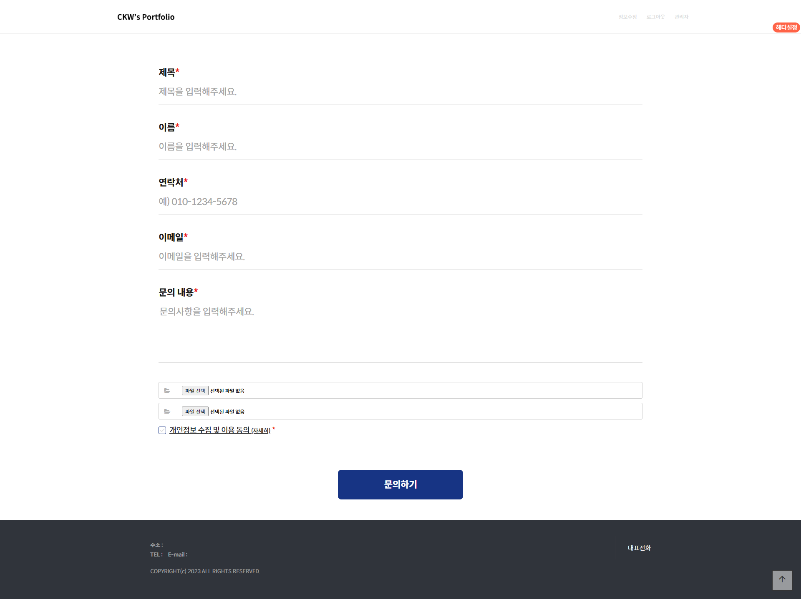
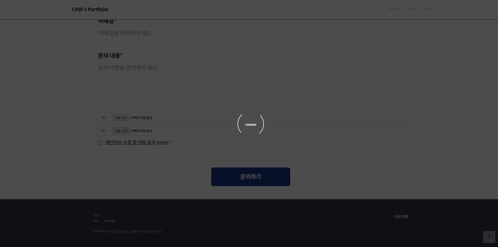
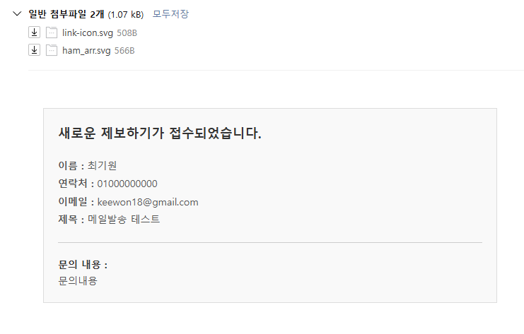
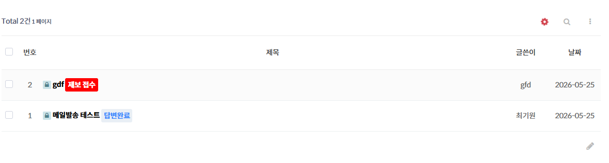
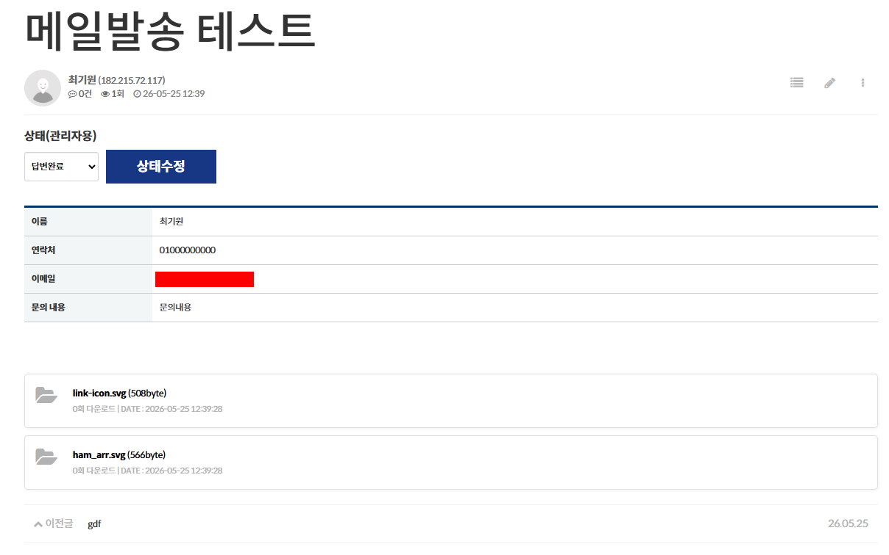

# 프로젝트 이름

그누보드-문의게시판 글쓰기&견적폼

## 🔗 데모
[데모 바로가기](https://keewon17.cafe24.com/portfolio/bbs/write.php?bo_table=inquiry)

---

## 📖 소개

그누보드 게시판 글 작성 & 메일발송 스킨입니다.
첨부파일까지 메일로 발송이 가능하며
구글 SMTP를 적용하여 누락없이 발송될 수 있도록 하였습니다.(참고 : https://www.wsgvet.com/home/681)
관리자는 해당 문의 상태를 설정할 수 있습니다. (대기, 확인중, 답변완료)

---

## 🛠 사용 기술

---

## 사용방법 - 문의 글쓰기

### 1. 문의 글 작성

글 작성 시 로딩폼 표시 (구글 SMTP 속도문제)

---

## 견적내용 확인 

### 1. 메일

### 2. 리스트페이지

### 3. 뷰페이지

